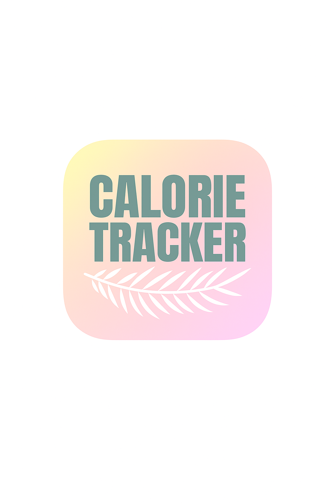
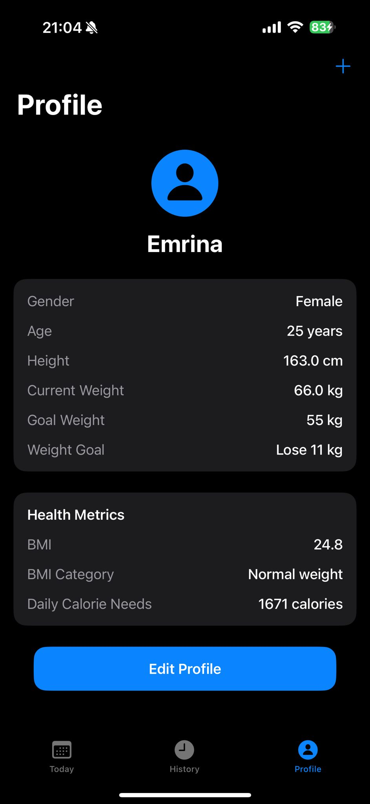
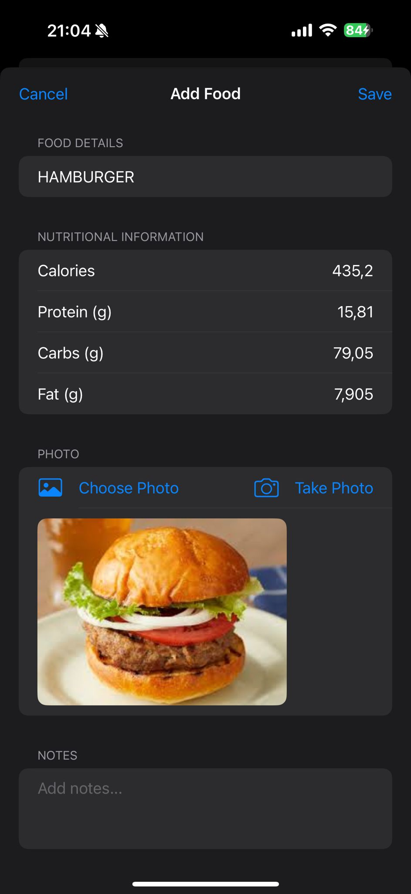
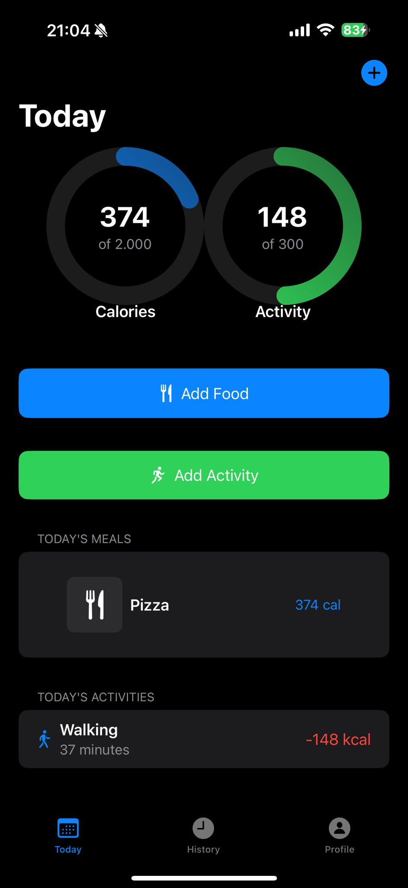

# CalorieTracker 📱

A comprehensive iOS calorie tracking application built with SwiftUI that helps users monitor their daily calorie intake, track activities, and achieve their fitness goals.

## Features ✨

### 🎯 Core Functionality
- **Daily Calorie Tracking**: Monitor calories consumed vs. burned with visual progress indicators
- **Meal Logging**: Add meals with detailed nutritional information (calories, protein, carbs, fat)
- **Activity Tracking**: Log exercises and activities to track calories burned
- **Weight Management**: Track weight changes over time with visual charts
- **Goal Setting**: Set and track weight goals (lose, gain, or maintain weight)

### 🚀 Advanced Features
- **AI Food Recognition**: Take photos of food to automatically detect and analyze nutritional content
- **Smart Onboarding**: Personalized setup based on user goals and activity level
- **Progress Visualization**: Beautiful charts and progress circles to track daily progress
- **Historical Data**: View past meals, activities, and weight entries
- **Profile Management**: Comprehensive user profile with BMR calculations

### 📊 Data & Analytics
- **Mifflin-St Jeor Equation**: Accurate BMR and calorie goal calculations
- **Macronutrient Tracking**: Detailed protein, carbohydrate, and fat breakdown
- **Progress Charts**: Visual representation of weight and calorie trends
- **Daily Summaries**: Quick overview of daily calorie balance

## Tech Stack 🛠️

- **Framework**: SwiftUI
- **Data Persistence**: SwiftData
- **Charts**: Swift Charts
- **Image Processing**: Vision Framework
- **Camera Integration**: AVFoundation
- **API Integration**: USDA Food Database, Roboflow Food Detection
- **Architecture**: MVVM Pattern

## Requirements 📋

- iOS 17.0+
- Xcode 15.0+
- Swift 5.9+

## Installation 🚀

1. **Clone the repository**
   ```bash
   git clone https://github.com/yourusername/CalorieTracker.git
   cd CalorieTracker
   ```

2. **Open in Xcode**
   ```bash
   open CalorieTracker.xcodeproj
   ```

3. **Configure API Keys** (Optional)
   - Add your USDA API key in `Config/APIConfig.swift`
   - The app includes a Roboflow API key for food detection

4. **Build and Run**
   - Select your target device or simulator
   - Press `Cmd + R` to build and run

## Project Structure 📁

```
CalorieTracker/
├── Views/                    # SwiftUI Views
│   ├── ContentView.swift    # Main app interface
│   ├── OnboardingView.swift # User onboarding flow
│   ├── ProfileView.swift    # User profile management
│   ├── AddFoodView.swift    # Food logging interface
│   ├── AddActivityView.swift # Activity logging
│   └── ...
├── Models/                   # Data Models
│   ├── UserProfile.swift    # User profile data
│   ├── Meal.swift          # Meal and activity data
│   ├── WeightEntry.swift   # Weight tracking data
│   └── ...
├── ViewModels/              # View Models
│   └── FoodAnalysisViewModel.swift
├── Services/                # API Services
│   └── USDAFoodDatabase.swift
├── Managers/                # Business Logic
│   └── HealthManager.swift
├── Config/                  # Configuration
│   ├── ModelConfig.swift   # SwiftData configuration
│   └── APIConfig.swift     # API configuration
└── Resources/               # Assets and resources
```

## Key Components 🔧

### Data Models
- **UserProfile**: Stores user information, goals, and calculated calorie targets
- **Meal**: Represents both food items and activities with nutritional data
- **WeightEntry**: Tracks weight changes over time
- **Food**: Detailed food information from USDA database

### Core Views
- **ContentView**: Main dashboard with calorie tracking and navigation
- **OnboardingView**: Multi-step user setup process
- **ProfileView**: User profile management and settings
- **HistoryView**: Historical data visualization

### Advanced Features
- **FoodPhotoAnalysisView**: AI-powered food recognition from photos
- **Charts Integration**: Beautiful data visualization using Swift Charts
- **Camera Integration**: Photo capture for food analysis

## Usage 📖

### Getting Started
1. **Onboarding**: Complete the setup process with your personal information
2. **Set Goals**: Choose your weight goal (lose, gain, or maintain)
3. **Configure Profile**: Enter your height, weight, age, and activity level
4. **Start Tracking**: Begin logging meals and activities

### Daily Tracking
- **Add Meals**: Log food items with nutritional information
- **Track Activities**: Record exercises and activities
- **Monitor Progress**: View daily calorie balance and progress
- **Update Weight**: Track weight changes regularly

### Advanced Features
- **Photo Analysis**: Take photos of food for automatic recognition
- **Historical View**: Review past data and trends
- **Profile Management**: Update goals and personal information

## API Integration 🔌

The app integrates with several APIs for enhanced functionality:

- **USDA Food Database**: Nutritional information for food items
- **Roboflow Food Detection**: AI-powered food recognition from images

## Contributing 🤝

1. Fork the repository
2. Create a feature branch (`git checkout -b feature/AmazingFeature`)
3. Commit your changes (`git commit -m 'Add some AmazingFeature'`)
4. Push to the branch (`git push origin feature/AmazingFeature`)
5. Open a Pull Request

## License 📄

This project is licensed under the MIT License - see the [LICENSE](LICENSE) file for details.

## Author 👨‍💻

**Emrina Şenel**
- GitHub: [@yourusername](https://github.com/yourusername)

## Acknowledgments 🙏

- USDA Food Database for nutritional data
- Roboflow for food detection API
- Apple for SwiftUI and SwiftData frameworks

## Screenshots 📸

  

## Roadmap 🗺️

- [ ] Apple Health integration
- [ ] Social features and sharing
- [ ] Meal planning and recipes
- [ ] Barcode scanning for packaged foods
- [ ] Apple Watch companion app
- [ ] Export data functionality

---

**Note**: This app is designed for personal use and should not replace professional medical advice. Always consult with healthcare professionals for dietary and fitness guidance.
